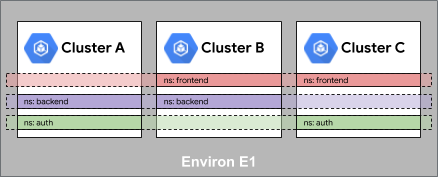
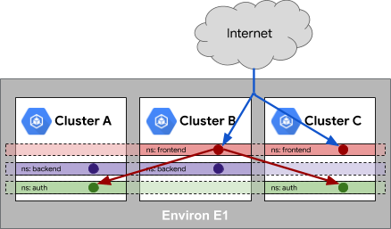

# Environments & Clusters
 
Organizations are often challenged with the need to run workloads in different locations for a variety of reasons. Additionally platform administrators are tasked with enabling multiple teams with low friction platforms that allow teams to deploy rapidly throughout multiple life cycles. Anthos incorporates multiple clusters across locations under one comprehensive platform, providing the ability to operate clusters across providers and datacenters, while reducing operational overhead. 

### Objectives
In this tutorial you’ll work with some of the fundamental concepts in Anthos related to creating clusters and grouping them into Environs within your projects.  

You’ll learn about:

- Provisioning Platform Resources
- Cluster Organization Best Practices
- Registering Clusters through Hub & Environs


## Before you begin
To get started with this lab you’ll need to install tooling, set a few variables and provision the environment. Follow the steps below to prepare your lab.

### Task: Install Tools

This tutorial utilizes terraform to provision the base clusters and Anthos components. Additionally this tutorial implements GitOps patterns backed by a git repository. In this example you’ll integrate Anthos with GitHub repositories. To facilitate creation of the repositories the tutorial creates repositories on your behalf. A Github Personal Access token will be used. You will be prompted and guided through the process in the next step.  

If you’re using cloudshell these tools will already be installed and you can skip this step. If you’re running this elsewhere be sure to install [gcloud](https://cloud.google.com/sdk/docs/downloads-interactive), [terraform](https://learn.hashicorp.com/terraform/getting-started/install.html) and [git](https://github.com/git-guides/install-git). 


### Task: Clone Lab Repository

Clone the repository onto your local computer and change into the directory.

```shell
git clone https://github.com/cgrant/anthos-workshop -b v2
cd anthos-workshop
```

### Task: Set Lab Variables

Set global variables that are used throughout the workshop

```shell
gcloud config set core/project YOUR_PROJECT #UPDATE WITH YOUR PROJECT
```
 
### Task: Prepare the workspace

In this task you’ll prepare your workspace for use in this lab. The commands below will update your gcloud components and set some additional global variables used throughout the examples. It will also create a GitHub repository from assets stored in the resources directory. 


Run the setup steps
```shell
source ./labs/env
$BASE_DIR/labs/platform/clusters/prep.sh
```


## Provisioning Resources

One of the fundamental challenges for platform teams is ensuring a way to consistently build and update core infrastructure resources across providers and onprem. Many of these organizations have adopted Terraform to help facilitate this automation.  In this example you’ll extend a set of existing resources to include an additional cluster with Anthos components enabled. 

### Task: Create an Anthos Cluster
 
Many organizations utilize Terraform for Infrastructure as code, ensuring repeatable infrastructure provisioning and configuration. Google works closely with Terraform to provide modules and resources for Google Cloud Platform services. 

In this section you’ll review the modules used to provision GKE clusters and enable Anthos components for seamless anthos provisioning. 

The complete files for the excerpts below can be found in `$BASE_DIR/workdir/tf `

Review the excerpts from both of the files listed in the box below to understand how Terraform can be used to provision Anthos components 


=== "cluster.tf"
    ```terraform

    module "prod-primary" {
        source                  = "terraform-google-modules/kubernetes-engine/google"
        name                    = "${var.gke_name}-prod-primary"
        project_id              = module.project-services.project_id
        regional                = false
        region                  = var.default_region
        network                 = var.network
        subnetwork              = var.subnetwork
        ip_range_pods           = var.ip_range_pods
        ip_range_services       = var.ip_range_services
        zones                   = var.default_zone

        node_pools = [
            {
            name         = "default-node-pool"
            autoscaling  = false
            auto_upgrade = true

            node_count   = 4
            machine_type = "e2-standard-4"
            },
        ]
    }
    # Cluster Credentials
    resource "null_resource" "configure_kubectl_prod_primary" {
        provisioner "local-exec" {
            command = "gcloud container clusters get-credentials ${module.prod-primary.name} --zone ${module.prod-primary.location} --project ${data.google_client_config.current.project}"
        }
        depends_on = [module.prod-primary]
    }

    ```
    The GKE module is used to create a new cluster. This example utilizes many of the defaults for a simple demonstration cluster, however you can configure many advanced on your own to build a complete production ready cluster.   In the above excerpt we’re creating the cluster and separately the code retrieves the cluster credentials so you can interact with it locally using command line tools. This step wouldn’t be used in a production configuration.

=== "acm.tf"
    ```terraform

    # Enable Anthos Configuration Management
    module "acm-prod-primary" {
        source           = "github.com/terraform-google-modules/terraform-google-kubernetes-engine//modules/acm?ref=fix-gcloud-install"
  
        skip_gcloud_download = true

        project_id       = data.google_client_config.current.project
        cluster_name     = module.prod-primary.name
        location         = module.prod-primary.location
        cluster_endpoint = module.prod-primary.endpoint

        operator_path    = var.acm_operator_path
        sync_repo        = var.acm_repo_location
        sync_branch      = "master"
        policy_dir       = "."
    }

    ```

    As you can see in the terraform script, we’re using the ACM submodule. This module requires a few key elements. The first section provides details about which GKE cluster you want to enable ACM on. In this case it’s passing in variables for cluster_name, location and cluster_endpoint provided by the GKE terraform module. 

    Specifically for the ACM module, you’ll also need to provide details about the git repository location to be used in the sync process. In this case values are provided for the acm_repo_location, utilizing the master branch and no subdirectory as noted by the “.” path for policy_dir. 

=== "asm.tf"
    ```terraform

    # Enable Anthos Configuration Management
    module "asm" {
        source           = "github.com/terraform-google-modules/terraform-google-kubernetes-engine//modules/asm"
        project_id       = data.google_client_config.current.project
        cluster_name     = module.stage.name
        location         = module.stage.location
        cluster_endpoint = module.stage.endpoint
    }

    ```
    This module utilizes a gke submodule specifically for installing ASM. Similar to the ACM module you’ll reference the cluster variables from the cluster module itself. This will implement correct dependency within terraform ensuring that the cluster has been created and is ready before trying to apply this module. 

### Task: Add a Cluster (optional)

In this step you'll attempt to create your own cluster. Inside `cluster.tf` try adding code to create a cluster called `prod-secondary` Don't add any ACM or ASM components at this stage though. If you complete this correctly, you should see 3 clusters following the next step. 

To test your configuration, you can run terraform plan with the script provided. 

```shell
cd $WORK_DIR/tf 
./tf-plan.sh
```
 
This will provide feedback about your configuration without actually applying any changes to your environment. Not only is it useful in understanding what changes your configurations will make but it also serves as a quick error check. 


### Task: Provision Resources

With the new additions to the Terraform scripts you’re ready to spin up the environment. Execute the commands below. 

```shell
cd $WORK_DIR/tf 
./tf-up.sh
```

This setup process will:

- Create 2 clusters: prod-primary, and stage
    - It will also create prod-secondary if you completed the previous optional task
- Pull the contexts locally for each cluster so you can interact via kubectl
- Install ACM on the prod-primary cluster and ASM on the stage cluster

This step will take ~5 minutes. 

## Working with Environs

A Google Cloud Platform (GCP) project can contain some resources that are enabled for Anthos and some that are not. For example you may have a series of GKE clusters utilizing Anthos features and while a separate sandbox cluster may have been spun up temporarily for testing purposes. To enable Anthos features on a Kubernetes cluster, whether on GCP or other location, you’ll need to register the cluster in an Anthos Environ, a unified organizational element across GCP, your Data Centers and other Cloud Providers. 

Clusters grouped in an Environ follow a concept of sameness. As noted in the product documentation, an important concept in environs is the concept of sameness. This means that some Kubernetes objects such as clusters with the same name in different contexts are treated as the same thing. This normalization is done to make administering environ resources more tractable. It provides some strong guidance about how to set up namespaces, services, and identities.

The fundamental example of sameness in an environ is namespace sameness. Namespaces with the same name in different clusters are considered the same by many components. Another way to think about this property is that a namespace is logically defined across an entire environ, even if the instantiation of the namespace exists only in a subset of the environ resources.




Anthos Service Mesh and Ingress for Anthos use the concept of sameness of services within a namespace. Like namespace sameness, this implies that services with the same namespace and service name are considered to be the same service.



### Task: Register With Anthos Hub
To add a cluster to an Anthos Environ the following steps need to be performed:

- Create a service account (SA) to connect the agent with Google
- Register the Cluster & SA with Anthos Environ

The service account is used by your cluster to communicate with Anthos in GCP. The registration process will create a membership for your cluster within GCP and initializes the Connect Agent on your cluster. 

Follow either the Console OR gcloud method below to register your cluster.


=== "Console"
    
    Click on Anthos -> Clusters from the left navigation

    

    Click on `Register Existing Cluster` from the top navbar

    

    Now click the `Register` button next to the `boa-prod-secondary` cluster

    
    
    Deselect the `Download new service key` option and click `Submit`

    

    Once all the steps have completed click `Done`


=== "gcloud"
    Create a service account
    ```shell
    export GKE_CONNECT_SA=gke-connect-sa
    export GKE_CONNECT_SA_FILE=$WORK_DIR/$GKE_CONNECT_SA-creds.json
    gcloud iam service-accounts create $GKE_CONNECT_SA --project=$PROJECT
    ```

    Create & download a key
    ```shell
    gcloud iam service-accounts keys create $GKE_CONNECT_SA_FILE \
    --project=$PROJECT \
    --iam-account=$GKE_CONNECT_SA@$PROJECT.iam.gserviceaccount.com 
    ```

    Register with hub

    ```shell
   
    GKE_CLUSTER=us-west1-b/boa-prod-secondary

    gcloud container hub memberships register boa-prod-secondary \
    --project=$PROJECT \
    --gke-cluster=$GKE_CLUSTER \
    --service-account-key-file=$GKE_CONNECT_SA_FILE

    ```

    Confirm Registration by running

    
    ```shell
    gcloud container hub memberships list
    ```
    
    Output
    
    <pre>
    NAME                EXTERNAL_ID
    boa-prod-secondary  e0f007ef-a9e6-11ea-88fb-42010a8a0002
    </pre>


### Cleanup Lab

If you're continuing on with the next lesson, skip this step, you'll use the resources in the next lab.

However if you'd like to teardown your environment simply run

```shell
cd $WORK_DIR/tf 
./tf-down.sh
```

## Resources

- [Anthos Technical Overview](https://cloud.google.com/anthos/docs/concepts/overview)
- [Anthos Environs](https://cloud.google.com/anthos/multicluster-management/environs)
- [Terraform GKE ACM Submodule](https://registry.terraform.io/modules/terraform-google-modules/kubernetes-engine/google/8.1.0/submodules/acm)
- [Terraform GKE ASM Submodule](https://github.com/terraform-google-modules/terraform-google-kubernetes-engine/tree/add-asm-module/modules/asm)
- [Register a cluster](https://cloud.google.com/anthos/multicluster-management/connect/registering-a-cluster)

