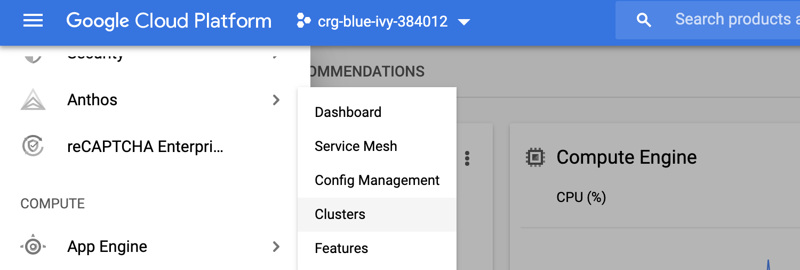
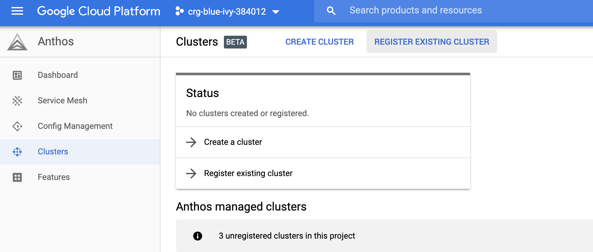
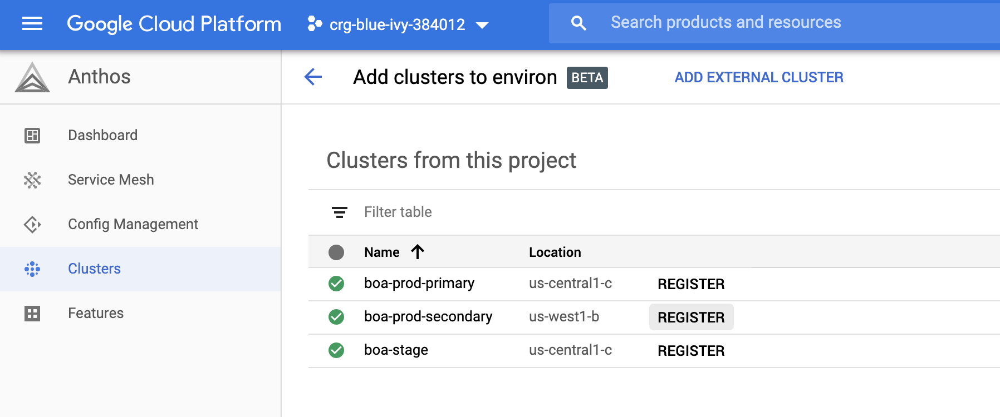
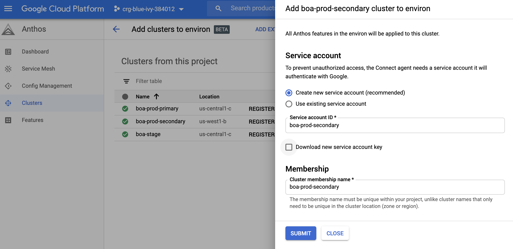

# Environments & Clusters

## Multi Cluster Use Cases

## Cluster Organization Best Practices

## Working with Projects, Hub & Environs

## Provisioning Platform Resources

---

## Lab

### Prerequisites

Clone the repository onto your local computer and change into the directory.

```shell
git clone sso://user/crgrant/anthos-workshop -b v2
cd anthos-workshop
```

Set global variables that are used throughout the workshop

```shell
BASE_GIT_URL=https://github.com/YOUR_ID
BASE_DIR=$(PWD)
PROJECT=$(gcloud config get-value project)
```
 
Install Terraform

- [ ] TODO: Terraform install instructions


### Write Terraform 

Add the lines from both of the tabs listed in the box below to the appropriate files located in `$BASE_DIR/labs/platform/clusters/tf`

=== "cluster.tf"
    ```terraform

    # Provision Stage Cluster
    resource "google_container_cluster" "stage" {
        name               = "${var.gke_name}-stage"
        location           = var.default_zone
        initial_node_count = 4
    }
    
    # Retrieve Cluster Credentials
    resource "null_resource" "configure_kubectl_stage" {
        provisioner "local-exec" {
            command = "gcloud container clusters get-credentials ${google_container_cluster.stage.name} --zone ${google_container_cluster.stage.location} --project ${data.google_client_config.current.project}"
        }
        depends_on = [google_container_cluster.stage]
    }
    ```

=== "acm.tf"
    ```terraform

    # Enable Anthos Configuration Management
    module "acm-stage" {
        source           = "terraform-google-modules/kubernetes-engine/google//modules/acm"
        skip_gcloud_download = true

        project_id       = data.google_client_config.current.project
        cluster_name     = google_container_cluster.stage.name
        location         = google_container_cluster.stage.location
        cluster_endpoint = google_container_cluster.stage.endpoint

        sync_repo        = "https://github.com/cgrant/cluster_config"
        sync_branch      = "stage"
        policy_dir       = "sample"
    }

    ```


### Provision Resources

```shell

cd $BASE_DIR/labs/platform/clusters/tf
terraform init
terraform apply

```
This will create 3 clusters: prod-primary, prod-secondary and stage then pull the contexts locally for each so you can interact via `kubectl`. 

It will also install anthos components on prod-primary and stage. You will manually enable components on prod-secondary in later steps. 

For convince we'll rename the clusters to shorter names of: prod1, prod2, stage

```shell
DEFAULT_ZONE="us-central1-c"
SECONDARY_ZONE="us-west1-b"

kubectl config rename-context gke_${PROJECT}_${DEFAULT_ZONE}_boa-prod-primary prod1
kubectl config rename-context gke_${PROJECT}_${SECONDARY_ZONE}_boa-prod-secondary prod2
kubectl config rename-context gke_${PROJECT}_${DEFAULT_ZONE}_boa-stage stage
```


### Register With Anthos Hub

To add a cluster to an Anthos Environ the following steps need to be performed:

- Create a service account (SA) to connect the agent with Google
- Register the Cluster & SA with Anthos Environ

Once the data has been submitted, Anthos will


=== "Console"
    


    Click on Anthos -> Clusters from the left navigation


    

    Click on `Register Existing Cluster` from the top navbar

    

    Now click the `Register` button next to the `boa-prod-secondary` cluster

    
    
    Deselect the `Download new service key` option and click `Submit`

    

    Once all the steps have completed click `Done`


=== "gcloud"
    Create a service account
    ```shell
    export GKE_CONNECT_SA=gke-connect-sa
    export GKE_CONNECT_SA_FILE=$BASE_DIR/$GKE_CONNECT_SA-creds.json
    gcloud iam service-accounts create $GKE_CONNECT_SA --project=$PROJECT
    ```

    Create & download a key
    ```shell
    gcloud iam service-accounts keys create $GKE_CONNECT_SA_FILE \
    --project=$PROJECT \
    --iam-account=$GKE_CONNECT_SA@$PROJECT.iam.gserviceaccount.com 
    ```


    Register with hub

    ```shell
   
    GKE_CLUSTER=us-west1-b/boa-prod-secondary

    gcloud container hub memberships register boa-prod-secondary \
    --project=$PROJECT \
    --gke-cluster=$GKE_CLUSTER \
    --service-account-key-file=$GKE_CONNECT_SA_FILE

    ```

    Confirm Registration by running

    ```shell
    gcloud container hub memberships list
    ```
    Output
    <pre>
    NAME                EXTERNAL_ID
    boa-prod-secondary  e0f007ef-a9e6-11ea-88fb-42010a8a0002
    </pre>


## Resources

- [Anthos Technical Ovverview](https://cloud.google.com/anthos/docs/concepts/overview)
- [Anthos Environs](https://cloud.google.com/anthos/multicluster-management/environs)
- [Terraform GKE ACM Submodule](https://registry.terraform.io/modules/terraform-google-modules/kubernetes-engine/google/8.1.0/submodules/acm)
- [Terraform GKE ASM Submodule](https://github.com/terraform-google-modules/terraform-google-kubernetes-engine/tree/add-asm-module/modules/asm)
- [Register a cluster](https://cloud.google.com/anthos/multicluster-management/connect/registering-a-cluster)

