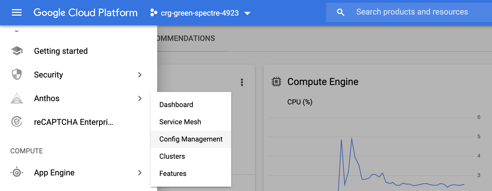
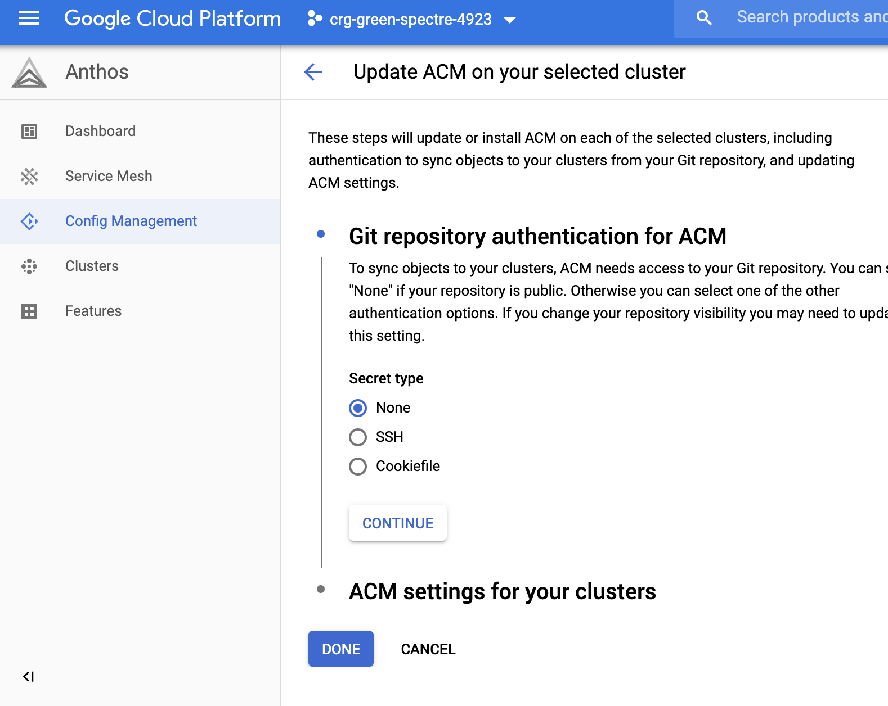
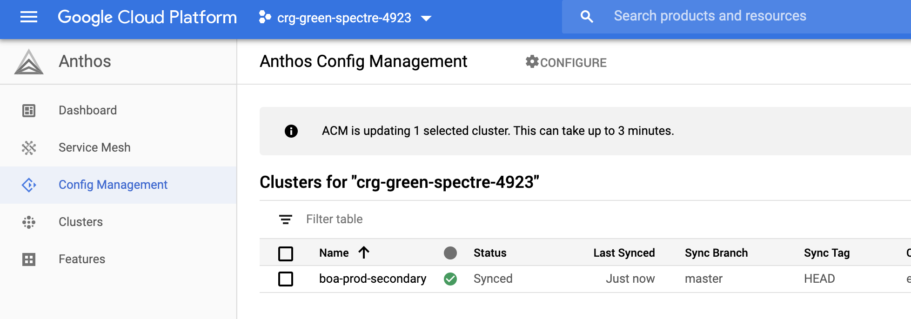

# Managing Configurations

## GitOps & Repository Syncing

## Abstract Namespaces

## Cluster Selectors

## Namespace Isolation

## Drift Management

---
## Lab

At the end of the last section you were left with the following running in your project. 

- Prod-primary cluster (prod1): ACM installed with Terraform
- Prod-secondary cluster (prod2): No ACM installed
- Stage cluster: You added terraform code to create the cluster and install ACM

In this next section you will install ACM manually on prod-secondary then utilize the features of Anthos Config Manager

### Prerequisites

Tools:

- [Terraform](https://learn.hashicorp.com/terraform/getting-started/install.html)
- [GitHub's cli gh](https://github.com/cli/cli)


If you completed the previous exercise, skip this step as your project will already be setup. 

If you did not complete the previous section, the following steps will setup a project to the state needed in this section. 

Clone the repository onto your local computer and change into the directory.


```shell
git clone sso://user/crgrant/anthos-workshop -b v2
cd anthos-workshop
```

Set global variables that are used throughout the workshop

```shell
export GIT_ID=YOUR_ID #UPDATE WITH YOUR ID
export GIT_BASE_URL=https://github.com/${GIT_ID}
export REPO_PREFIX="anthos"


export PROJECT=$(gcloud config get-value project)
export BASE_DIR=$(PWD)
export WORK_DIR=${BASE_DIR}/workdir
mkdir -p $WORK_DIR
```
 


Provision Base Infrastructure

```shell
$BASE_DIR/labs/platform/config/prep.sh

```

This will create 2 clusters: prod-primary, prod-secondary then pull the contexts locally for each so you can interact via `kubectl`. 

It will also install anthos components on both clusters.

The manual steps from the previous section were added to a script in this section. Run the following command to finish preparing your environment


### Split Screens
To watch the changes more easily it's helpful to have 2 terminals open side by side.  There are multiple ways to accomplish this. 

=== "Cloud Shell"
    In Cloud Shell you can use a popular command line called utility tmux natively to multiplex your Cloud Shell window. In Cloud Shell, tmux commands are initiated with the Ctrl+B key combination. This tells tmux to listen to the next input as its command. Any time you interact with tmux you'll start with the Ctrl+B combination followed by the action you want tmux to perform. Let's see this in practice.

    In your Cloud Shell, type Ctrl+B then % (shift-5).

    You should now see a split screen.

    In this view you can see the left pane is active where the cursor is identified.


    To navigate between the two panes type Ctrl+B then left or right arrow

=== "VS Code"
    VS Code provides the ability to split your terminal in the terminal tool bar on the right. Just to the left of the trash icon you'll find the split screen icon. Click it to utilize multiple panes in the same view. To navigate between panes simply click in the desired pane to activate focus. 

=== "Other"

    You can simply open a second window in your terminal of choice, then place the two windows side by side. This will allow you to execute commands in one window while seeing the results in the other

### Watch the resources

This command utilizes the `watch` command to continuously display command results. In the right terminal pane, execute teh following command

```shell
watch \
    "echo '## Prod1 Namespaces ##'; \
    kubectl --context prod1 get ns; \
    echo '\n\n## Stage Namespaces##'; \
    kubectl --context stage get ns; \
    echo '\n## bank-of-anthos pods on Stage ##'; \
    kubectl --context stage get po -n bank-of-anthos"
```

This will list the Namespaces for both Prod1 and Stage. You should notice the `bank-of-anthos` namesepace exists only in Prod1. You'll also see a list of pods running in the `bank-of-anthos` namespace on Stage. Since there is no namespace matching that yet, no resources are displayed. 

### Install Anthos ConfigManager 

Config Manager utilizes 2 components to function. First is an operator that manages the various functions and clusters. The second component is the configuration about the repo to sync with. In this section you'll install these components on the prod-secondary

Choose one of the following methods below

=== "Console"

        (Choose STAGE for all these )

    From the left navigation choose Anthos -> Config Management

    

    Check the box next to boa-stage, then click configure at the top of the page

    

    Select none for authentication then click continue

    

    Add the location of your repo and set master for the branch. 
    
    Then click Done

        (do not change advanced settings)


    In a moment your cluster should sync and you should be able to see the resources in your watch pane

    

=== "gcloud"

    In this first step we'll retrieve the operator manifest and install the it on the prod-secondary cluster.

    ```shell
   
    kubectl --context stage apply -f $BASE_DIR/resources/acm/config-management-operator.yaml

    ```

    Apply the Repo Configuration


    Now that the operator is installed you'll configure it to watch your git repository. First review the ConfigManagement resource we're about to apply. Edit the `$BASE_DIR/labs/platform/config/acm-repo.yaml` file and change the `syncRepo` to point to your ACM_REPO

   

    ```shell

    cd $BASE_DIR/labs/platform/config/
    cat <<EOF > acm-repo.yaml
    apiVersion: configmanagement.gke.io/v1
    kind: ConfigManagement
    metadata:
    name: config-management
    spec:
    # clusterName is required and must be unique among all managed clusters
    clusterName: prod2
    git:
        syncRepo: ${ACM_REPO}
        syncBranch: master
        secretType: none
        policyDir: "."
    EOF


    ```


    You'll be able to see the git repository we're syncing to, the branch and directory we want applied. In this case we're using a public repository so secretType is set to `none`

    Now execute the following command

    ```shell

    kubectl --context stage apply -f $BASE_DIR/labs/platform/config/acm-repo.yaml

    ```

    In just a moment you should see the bank-of-anthos namespace show up in staeg and resources start creating within the namespace. 


### Create a Namespace

In this step you'll create a namespace, commit it to the repository and watch it apply to both clusters

```shell
cd $BASE_DIR/workdir/hydrated-config/
NS=nginx

mkdir namespaces/${NS}
cat <<EOF > namespaces/${NS}/namespace.yaml
apiVersion: v1
kind: Namespace
metadata:
  name: ${NS}
  labels: 
    istio-injection: enabled
EOF

git add . && git commit -m "new NS" && git push origin master

```

### Config Drift Management

In this step you'll see how ACM manages configuration drift automatically within your clusters. If a resource is changed inside the cluster without flowing through the designated repository, ACM will revert the changes and reapply the affected resources. 

Watch the resource window carefully in these steps as the change happens quickly. 

Delete the Namespace you just created
```shell

kubectl --context stage delete ns ${NS}
```
Almost immediately ACM replaces the namespace.

Try again, this time deleting a pod
```shell
kubectl --context stage delete deployment contacts -n bank-of-anthos
```
Notice the replacement pod being created

### NS Isolation

In this next step you'll touch on some safety features in ACM. Typically when running `kubectl apply` the resource manifests can include data indicating which namespace they should be deployed to. This can become a security concern if a resource contained within a folder for one namespace, indicates it should be deployed to a different namespace. Naive deployment engines would simply apply the resource, allowing teams to modify resources in different namespaces.

ACM will not allow resources from one namespace folder to be deployed to a different namespace

You'll try to apply a resource contained within the ${NS} namespace to the bank-of-anthos namespace. Review `$BASE_DIR/labs/platform/config/nginx.yaml`. Notice the namespace listed is bank-of-anthos.

```
apiVersion: apps/v1 
kind: Deployment
metadata:
  name: nginx-deployment
  namespace: bank-of-anthos
...
```

Move that file into the ${NS} directory and push it to the repo

```shell
cp $BASE_DIR/labs/platform/config/nginx.yaml $WORK_DIR/hydrated-config/namespaces/${NS}
git add . && git commit -m "adding nginx" && git push origin master
```

You'll notice the resource is not deployed to bank-of-anthos namespace, or nginx namespace. ACM blocks the deploy of that resource. 

Cleanup
Make sure to delete the Nginx deployment from the repo so the sync process can continue

```shell
rm -rf $WORK_DIR/hydrated-config/namespaces/${NS}
git add . && git commit -m "removing nginx" && git push origin master

```

### Cleanup

If you're continuing on with the next lesson, skip this step, you'll use the resources in the next lab. 

However if you'd like to teardown your environment simply run
```shell
cd $WORK_DIR/tf 
./tf-down.sh
```

## Resources
