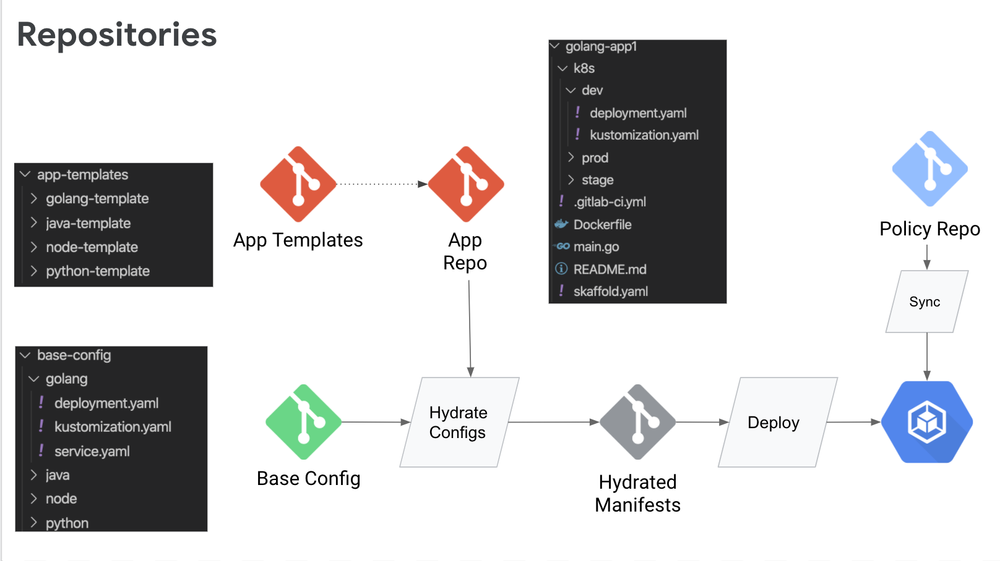

# Anthos Pipeline

Teams utilizing Anthos often look for a robust and scalable pattern for delivering applications through the various life cycles of development such as dev, stage and production. Furthermore, mission critical applications often require more advanced rollout patterns to minimize or eliminate downtime.  Platform teams building these pipelines are further challenged by the number of teams and variety of application languages present in many organizations. 

Multiple environments, multiple clusters, multiple teams, multiple languages can be a challenge for application delivery. 

In this lab you’ll explore a pattern for scalable application delivery with the Anthos Pipeline. 

### Objectives

- Review Pipeline Stages & Contracts
- Define the Pipeline Repositories
- Build & Push Images
- Hydrate with Kustomize
- Deploy Applications

## Before you begin
If you completed the previous exercise, skip this step as your project will already be set up.
If you did not complete the previous section, you’ll need to install tooling, set a few variables and provision the lab environment. Follow the steps below to prepare your lab. 

### Task: Install Tools
- Terraform
- GitHub's cli gh

### Task: Clone Lab Repository
Clone the repository onto your local computer and change into the directory.

git clone sso://user/crgrant/anthos-workshop -b v2
cd anthos-workshop
 
### Task: Set Lab Variables
Set global variables that are used throughout the workshop

export GIT_ID=YOUR_ID #UPDATE WITH YOUR ID
export GIT_BASE_URL=https://github.com/${GIT_ID}
export REPO_PREFIX="anthos" 

export PROJECT=$(gcloud config get-value project)
export BASE_DIR=$(PWD)
export WORK_DIR=${BASE_DIR}/workdir
mkdir -p $WORK_DIR
 
### Task: Provision Infrastructure

$BASE_DIR/resources/provision/finish/prep.sh
 


## Pipeline Stages & Contracts
- Repos
- Build
- Hydrate
- Deploy

## Repositories


The pipeline is designed to support a large number of applications and teams with minimal overhead. To enable this, the framework suggests 4 types of repositories. 

**App Templates**:

- A set of repositories to act as templates for common application types. These repos contain application source code, k8s configuration, and ci/cd configs to help teams bootstrap new applications in the pipeline. New applications are copied from this set of repos. 

**Base Config Repo**:

- Base yaml configurations leveraged by applications. The applications include these base configurations to create fully formed deployment yamls. These minimize the amount of configuration managed by the app teams and centralizes common patterns like labeling, health checking and rollout strategies. 

**App Repo**:

- The traditional application source repositories used by the application teams to store code and other assets. These also contain Kubernetes configuration overrides unique to the application and/or environment

These repos will include

  - Application Source Code
  - Dockerfile
  - CI Config
  - Deployment Manifests
  - skaffold.yaml (optional)


**Hydrated Config Repo**:

- This repository contains the yamls that represent the desired state of the clusters. The clusters apply the k8s yamls in this repo during the deploy process. This may be represented by one or more repositories depending on your usage of the framework. For example utilizing ACM for config and deploy resources will use one repository. Utilizing ACM for config and separate tool for deploy you might utilize a separate repo for that tool. 

- The hydrated config repo(s) stores configs separately per environment (dev/stage/prod). A pattern is shown in this example utilizing branches to separate the environments.


### Task: Setup The Repositories
The composition of the various git repositories is central to the pipeline process. We've already been working with the hydrated-config repository that holds all our fully rendered yaml resources that are applied through Anthos Config Management.
In this step you'll create the app-templates repository and the base-config repository. Just like with the hydrated-config repos, these repositories are reused by each app and only need to be set up once.

Sample repos are provided in this workshop. The command below will make a copy of the sample repos and post new repos for them in your github account.


```shell
$BASE_DIR/labs/platform/pipeline/gh-create-base.sh
```


### Task: Create new App
In this step we'll create a new application. The process simply copies a repo from the app-templates based on the language chosen. The app repo is customized to reflect the name for the app then pushed to GitHub as a new repo. The process also sets up a new namespace in all the clusters through ACM. This process would be executed for each new app.
For this example we'll create a new golang app called myapp with the command below


```shell
$BASE_DIR/labs/platform/pipeline/gh-create-app.sh golang myapp
```

## Build

## Hydrate
The Build, Hydrate and Deploy steps would normally be part of a CI system and triggered by commits or merges. They're broken out here for demonstration purposes.

### Task: Build & Hydrate

In this step you're acting as a CI system. The first task for the system is to clone the appropriate repositories. The second task for the CI system is to build the image and hydrate the manifests. For this lab because the two scripts have been separated you can run the hydrate command multiple times independent of other tasks to see the effects.
Run the following commands


```shell
$BASE_DIR/labs/platform/pipeline/pull-repos.sh anthos-myapp
$BASE_DIR/labs/platform/pipeline/hydrate.sh anthos-myapp
```


## Deploy
In a typical CI/CD process once an image has been built and pushed, and the resource yamls have been hydrated, a deployment is triggered to roll the new assets out to an environment. 

### Task: Deploy with ACM
In this tutorial we've highlighted how Anthos Config Manager can be used to deploy more than just RBAC controls. In practice, organizations will use agents in the clusters or tools like CloudBuild and gke_deploy to deploy. For simplicity of this walk through we'll continue through with ACM. 

Currently all our environments are deploying assets using same hydrated-config master branch. To deploy our assets only to the stage environment, we could use ClusterSelectors within ACM, however for better separation of concerns between prod and lower life cycles you'll want a separate branch or even separate repository all together. ClusterSelectors would be a good option for targeting one production cluster over another.

To update the stage to utilize the stage branch of the hydrated-config repo instead of master, you'll need to update the configuration. This can be done through the console or the command line as shown below. 

Run the following commands to update the syncBranch to stage, and apply the resources. 

```shell

cd $WORK_DIR
cat <<EOF > acm-repo.yaml
apiVersion: configmanagement.gke.io/v1
kind: ConfigManagement
metadata:
  name: config-management
spec:
  # clusterName is required and must be unique among all managed clusters
  clusterName: stage
  git:
    syncRepo: ${ACM_REPO}
    syncBranch: stage
    secretType: none
    policyDir: "."
EOF


kubectl --context stage apply -f ./acm-repo.yaml
```


Now that our stage environment is watching the stage branch, we can push our changes. 

Recall that we completed the next steps with fully hydrated yamls reflecting our image updates and config changes. These files were saved in the cicd_workspace in the hydrated config repo directory. Before saving, the system switched to the stage branch so the resources would not be applied to master/prod. 

At this point, to deploy with ACM we simply need to push the directory to GitHub run the command below to complete the deploy. 


```shell
$BASE_DIR/labs/platform/pipeline/deploy.sh 
```

Finally the CICD system would typically be utilizing an ephemeral workspace where assets are deleted between runs. To mimic that, simply run the cleanup steps below to delete the directory. 

```shell
cd $WORK_DIR
rm -rf $WORK_DIR/cicd_workspace
```
## Lab Cleanup

If you're continuing on with the next lesson, skip this step, you'll use the resources in the next lab. 

However if you'd like to teardown your environment simply run
```shell
cd $WORK_DIR/tf 
./tf-down.sh
```

## Resources
